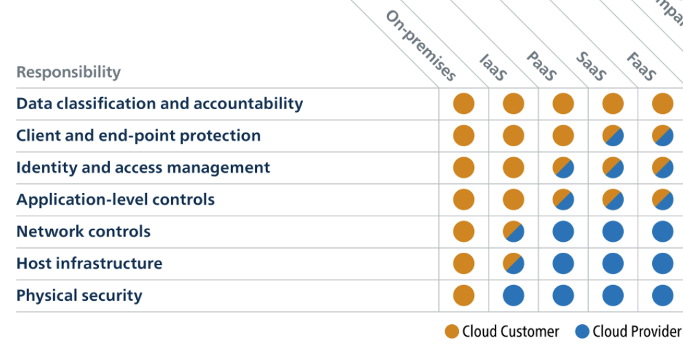
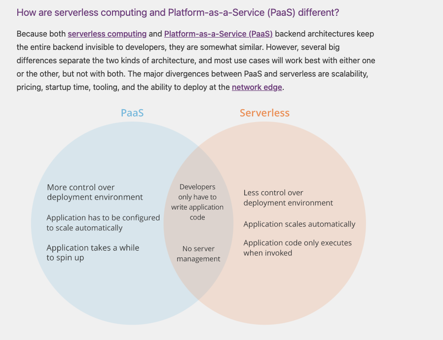
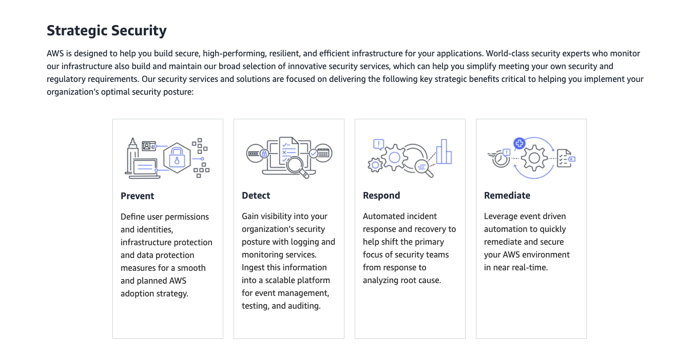
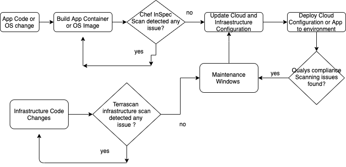

# What is this?

Multiple times I have been forced to explain the complexity of AWS Cloud Security for a DevOps or infrastructure engineer.
But how that complexity could be understood with just a few steps and a general vision for someone who is trying to start doing this job in a day to day basis?
For this I divided the DevOps security for  AWS Cloud in six aspects and two part 

## Index

1. Part I. Understanding  Cloud Computing Model Customer Responsibilities, and AWS Security Competency

2. Part II. Technical Competencies

  2.1 Security Frameworks and  Guidelines(OWASP, NIST, CIS and also AWS Security Best Practice for each service WhitePapers and blogs)
  2.2 AWS Compliances and Standards for Certification (HIPAA, PCI, FedRAMP)
  2.3 AWS Native Security Tools
  2.4 AWS DevOps Security  and DevOps Security Pipeline, IaC
  2.5 AWS CLI
  2.6 Python tools and development
  2.7 Everything is a big API ready for enginners to crete amazing stuff, but ...

### Content

#### Part I. Understanding  Cloud Computing Model Customer Responsibilities, and AWS Security Competency

**Cloud Computing Models**

**Cloud Computing Models , vs User/Cloud Provider Responsibilities**

**Differences between PaaS vs Serverless**

**Understanding Strategy Security and AWS Security Competences**

**AWS Strategic Security**

**AWS Strategic Competences**

#### Part II .Technical Competencies

It is importnat we clearly see these seve aspect reagrding Cloud, Cloud Development , DevOps, and Security.
So let's mention them here one more time and try to understand the implication of each aspect and its importance

  1. Security Frameworks and  Guidelines(OWASP, NIST, CIS and also AWS Security Best Practice for each service WhitePapers and blogs)
  2. AWS Compliances and Standards for Certification (HIPAA, PCI, FedRAMP)
  3. AWS Native Security Tools
  4. AWS DevOps Security  and DevOps Security Pipeline, IaC
  5. AWS CLI
  6. Python tools and development
  7. Everything is a big API ready for enginners to crete amazing stuff, but ...

## Implications

There are some  implications in those sevents aspects.

Basically it's required for a security engineer not only the knowledge and understanding of security, but also a high level of skill for development, understanding of compliances tools and standards, knowledge of Security Frameworks , in top of understanding of AWS native tools, creation of DevOps Security Pipeline
creation of IaC(terraform , cloud formation) and its verification, and  use of aws cli.

We will below how each aspect impact security and the whole cloud infraestructure and applications

### I- Security Frameworks and  Guidelines(OWASP, NIST, CIS)

You could follow the following guidelines to stablishes the security of your cloud infraestructure

- OWASP
  - Container Security Verification Standard(OWASP CSVS)
  - [OWASP CSVS url](https://github.com/OWASP/Container-Security-Verification-Standard)

- NIST
  - NIST Special Publication 800-190
  - Application Container Security Guide
  - (https://nvlpubs.nist.gov/nistpubs/specialpublications/nist.sp.800-190.pdf)

- CIS (Center for Information Security)
  - Securing Docker
  - (https://www.cisecurity.org/benchmark/docker/)

- [OWASP AWS documents in Archive](https://owasp.org/www-pdf-archive/)
  - 1- (https://owasp.org/www-pdf-archive//AWS_Security_-_Staying_on_Top_of_the_Cloud.pdf
  - 2- https://owasp.org/www-pdf-archive//Aws_security_joel_leino.pdf
  - 3- https://owasp.org/www-pdf-archive//OWASP_Toronto_-_Aug_2017_-_Cloud_Security_&_Best_Practice_in_AWS_by_Ankit_Giri.pdf

- AWS Security Best Practice(SBP) and Recomendations for each service
  - [Security Best Practices for Amazon S3](https://aws.amazon.com/s3/security/?nc=sn&loc=5)
  - [Security Best Practices for Amazon EC2](https://docs.aws.amazon.com/AWSEC2/latest/UserGuide/ec2-security.html)
  - [Security Best Practice for Serverless](https://docs.aws.amazon.com/whitepapers/latest/serverless-architectures-lambda/security-best-practices.html)
  - [Security Best Practice for Kubernettes EKS](https://docs.aws.amazon.com/eks/latest/userguide/best-practices-security.html)
  - [Security Best Practice for Kubernettes ECS](https://docs.aws.amazon.com/AmazonECS/latest/developerguide/security.html)

- AWS Whitepapers
  - A collection of AWS Whitepapers where we can filter for security concersn at https://aws.amazon.com/whitepapers/

- AWS Security Blog
  - AWS Security Blog: https://aws.amazon.com/blogs/security/tag/devsecops/

- AWS Well-Architedted Framework
  Creating a software system is a lot like constructing a building. If the foundation is not solid, structural problems 
  can undermine the integrity and function of   the building. When architecting technology solutions, if you neglect the 
  five pillars of operational excellence, security, reliability, performance efficiency,     and cost optimization, it can 
  become challenging to build a system that delivers on your expectations and requirements. Incorporating these pillars into 
  your architecture will help you produce stable and efficient systems. This will allow you to focus on the other aspects 
  of design, such as functional requirements.
  
  - Operational Excellence
  - Security
  - Reliability
  - Performance Efficiency
  - Cost Optimization

    Learn More about this  [here](https://wa.aws.amazon.com/wat.pillars.wa-pillars.en.html)
    
    This image represent the AWS Well Architect Framework
    

Take into account hat compliance Standards that we will analize in point II , as part of the regulatory obligations to be met by certains sectors or entity 
could require an increase in the level of security, or even forbid the use of certains Cloud Offerings  alltoghether or limit the use of those offering to certain regions etc.

## II- AWS Compliances and Standards for Certification (HIPAA,PCI, FedRAMP)

 [References](https://aws.amazon.com/compliance/)
 
- 1	The Federal Risk and Authorization Management Program (FedRAMP) is a US government-wide program that delivers a standard approach to the security assessment, authorization, and continuous monitoring for cloud products and services
- 2	FedRAMP documents https://d1.awsstatic.com/whitepapers/compliance/Guidance_for_Trusted_Internet_Connection_TIC_Readiness_on_AWS.pdf
- 3	HIPAA https://aws.amazon.com/compliance/hipaa-compliance/
  - 3.1 HIPAA Architecture Compliance https://aws.amazon.com/quickstart/architecture/compliance-hipaa/
    - 3.1.1 See in above link Security Mapping Control and Deployment Guide
  - 3.2 AWS HIPAA Compliance Whitepaper https://d1.awsstatic.com/whitepapers/compliance/AWS_HIPAA_Compliance_Whitepaper.pdf
- 4	PCI https://aws.amazon.com/compliance/pci-dss-level-1-faqs/
- 5	FedRAMP https://aws.amazon.com/compliance/fedramp/
- 6 AWS Services in Scope by Compliance Program https://aws.amazon.com/compliance/services-in-scope/

Compliance Programs could :

- limit the use or certain cloud offering , 
- require different(usually higher) securiry requirements than the ones you originally implemented
- require certains procedures

**Examples**:

- **Ex1: FedRamps will limit AWS Cloud Offering to the following regions, that are the only regions FedRamps compatible:

 - AWS GovCloud (US).
 - AWS US East/West regions.

- **Ex2: FedRamps could  ask  certains level of AWS Server Side,Client Side encryption

- **Ex3: FedRamps forbits the use of certain cloud offering in their zone: Example inside AWS GovCloud (US) we can not use Macie or CloudFront

- **Ex4: FedRamps would require a revision if you want to use certain cloud offering : For example to use AWS-XRay it requires a JAB Review 

### III- AWS Native Security Tools

-	Each Service has its own security concerns that we should look in AWS documentation.
  -	AWS CloudWatch:   https://aws.amazon.com/cloudwatch/
  -	AWS CloudTrail:   https://aws.amazon.com/cloudtrail/
  -	AWS Config:       https://aws.amazon.com/config/
  -	AWS Inspector:    https://aws.amazon.com/inspector/
  -	AWS Guard Duty:   https://aws.amazon.com/guardduty/
  -	AWS WAF:          https://aws.amazon.com/waf
  -	AWS Shield:       https://aws.amazon.com/shield/
  -	AWS Security Hub: https://aws.amazon.com/security-hub/
  -	AWS Macie:        https://aws.amazon.com/macie/
  -	AWS X-Ray:        https://aws.amazon.com/xray/

### IV- AWS DevOps Security  and DevOps Security Pipeline

Ref: https://github.com/david68cu/aws-architect-project3-Implementing-Security

Four Aspect to take into account for a technician from a practical perspective

- IV.1 AWS DevOps Security Pipeline
- IV.2 Infrastructure as Code Scanning Tools(Terraform and CloudFormation)
- IV.3 Scan containers for OS Vulnerabilities
- IV.4 Qualys Virtual Scanner Appliance HVM 

#### IV.1- AWS DevOps Security Pipeline

#### IV.2 Infrastructure as Code Scanning Tools

- CloudFormation scanning tools Ex: Cfripper. Some of the compliance violation or vulnerability which it might expose.

  - open S3 buckets,
  - unnecessarily wide port ranges on EC2 instances,
  - disabled encryption on databases and more.
  
- Terraform scanning tools Ex: Terrascan( https://github.com/accurics/terrascan)

  - Detect compliance and security violations across Infrastructure as Code to mitigate risk before provisioning cloud native infrastructure.
  - 500+ Policies for security best practices
  - Scanning of Terraform (HCL2)
  - Scanning of Kubernetes (JSON/YAML), Helm v3, and Kustomize v3
  - Support for AWS, Azure, GCP, Kubernetes and GitHub

#### IV.3 Scan containers for OS Vulnerabilities

Chef InSpec: execute scans against local or remote machines .

#### IV.4 Qualys Virtual Scanner Appliance HVM

- Qualys provides a cloud agent that can be installed either on EC2 or at the source into AMI for automated asset discovery ,classification, monitoring, and vulnerability remediation.
  -	What ports are open in an instance?
  - What ports are listening for connections?

## V- AWS CLI 

-	Programmatically accessing multiple aws api to retrieve information about the services they offer
-	Programmatically accessing multiple aws sdk to configure new services

## VI- Python tools, programming and integrations

- One of the most powerful skills you can have is being a good developer
- You are able to create APIs, Cloud Applications , Serverless, Containers, Understand IaC CloudFormation or Terraform and Integrate AI/ML and understand architecture principles in AWS
- You use an arsenal of Offensive, Defensive and Auditing tools , like the ones described below
  - [Python Security Tools for AWS](https://github.com/toniblyx/my-arsenal-of-aws-security-tools)
- You create your own tools when needed

